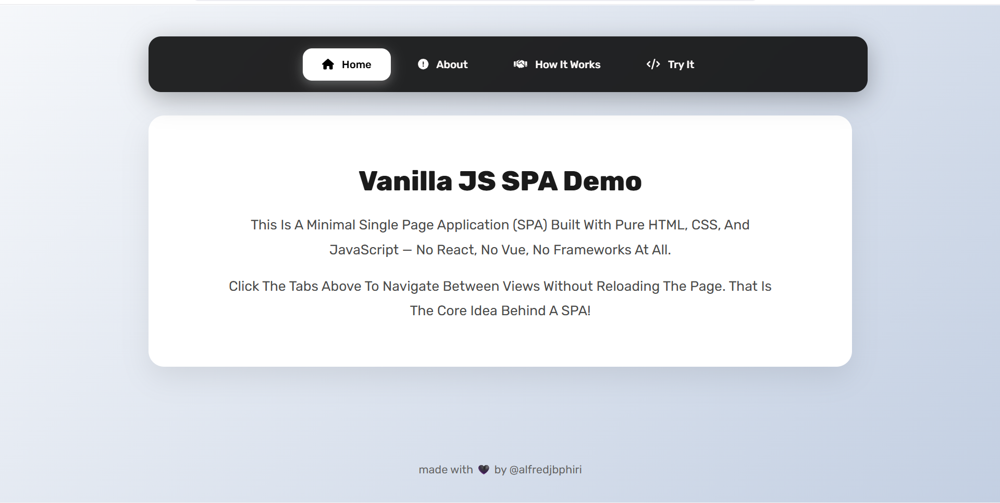

# Vanilla JS SPA Demo

A minimal **Single Page Application (SPA)** built with pure HTML, CSS, and JavaScript — no React, no Vue, no frameworks, no drama.

---

## What's This?

This project demonstrates how to achieve SPA-like navigation using only:
- `HTML` 
- `CSS` 
- `JavaScript` 

No build tools. No dependencies. Just vanilla browser APIs.

---

## How It Works

1. **Hide all sections** ~ A `hideAll()` function sets every content section's `display` to `none`
2. **Show the active section** ~ The matching section is set to `display: block`
3. **Track the active tab** ~ An `.active` CSS class is toggled to highlight the current tab
4. **Zero reloads** ~ The page never navigates away; content swaps happen in-place

Want to go further? Extend it with `window.history.pushState()` for real URL-based routing.

---

## File Structure

```
simple-tab/
├── index.html
├── css/
│   └── style.css
├── js/
│   └── tabs.js
└── fontawesome/  ← local icons (no CDN needed)
    ├── css/
    ├── js/
    └── webfonts/
```

---

## Getting Started

1. Clone it:
   ```bash
   git clone https://github.com/alfredphiri/simple-tab.git
   ```
2. Open `index.html` directly in any browser — no server required

3. Click the tabs and watch content swap without a page reload 

---

##  Tabs

- **Home** ~ Introduction to the demo
- **About** ~ What a SPA is and why it matters
- **How it Works** ~ Step-by-step breakdown of the JS logic
- **Try it** ~ Tips to fork, extend, and experiment

---

## Preview



---

## Author: **alfredjbphiri**

> [](mailto:alfredjbphiri@gmail.com)

> [](https://wa.me/265888057086)

---

##  License

MIT ~ use it, remix it, learn from it.
