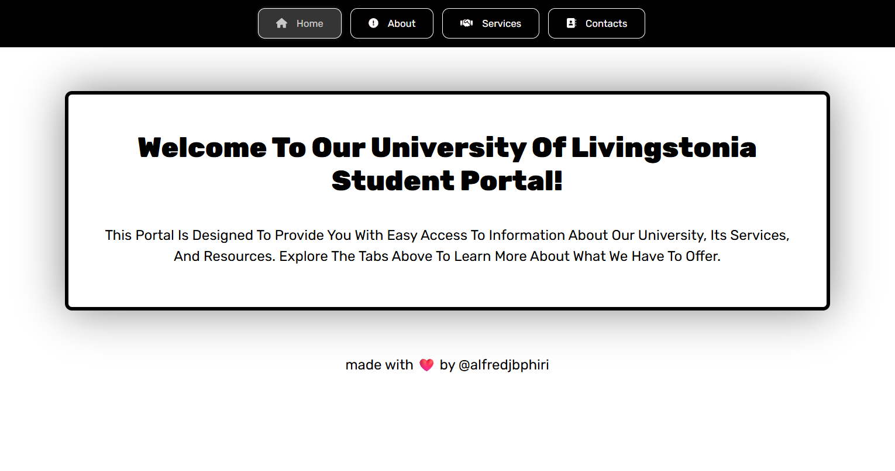

# 🚀 simple Tabs Built by @alfredjbphiri 💻❤️

## UI is Trash I know 😒👌

Welcome to the **coolest tabbed student portal😂😂** on the block 😎  
Made at **UNILIA LAWS Campus**  repping that ICT life 📚👨🏽‍💻

---

## 📌 What’s This?

A smooth, scroll-free tab interface using just:
- `HTML` ✅
- `CSS` ✅
- `JavaScript` ✅  
No frameworks. No drama. Just vibes.

---

## 🧠 Tabs You Get

- 🏠 **Home** – the welcome zone  
- 📖 **About** – who we are & why we exist  
- 🛠️ **Services** – we gotchu (library, advisors, career stuff)  
- 📞 **Contact** – reach out, don’t ghost 🙃

---

## 🧱 File Vibes

```
project/
├── index.html
├── css/
│   └── style.css
├── js/
│   └── tabs.js
└── fontawesome/  ← local icons (no CDN struggle)
    ├── css/
    ├── js/
    └── webfonts/
```

---

## ⚙️ How To Use

1. Clone it like a boss:
   ```bash
   git clone https://github.com/alfredphiri/simple-tab.git
   ```
2. Open `index.html` in any browser (Chrome, Edge, Firefox no judgment)

3. Click tabs ➡ enjoy the content slide in like magic ✨

---

## 🎨 Customize It

Want to flex your design skills?

- Change icons using Font Awesome classes (`fa-solid fa-house` etc.)
- Tweak text in `index.html`
- Restyle it in `style.css` (go wild with colors)

---

## 🔥 Screenshot Preview (Optional)



---

## ✍️ Author

Made with ❤️, code, and maybe a little procrastination by **@alfredjbphiri**


> Let’s connect or collab — don’t be shy 👇

> [](mailto:ict-01-09-23@unilia.ac.mw)

> [](https://wa.me/265991234567)


---

## ⚡ License

MIT – use it, remix it, just don’t sell it to your lecturer 😅
